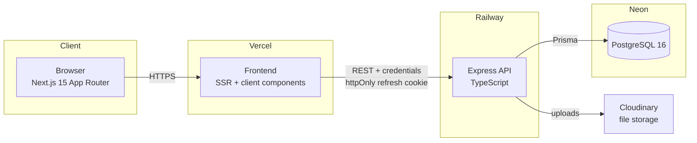
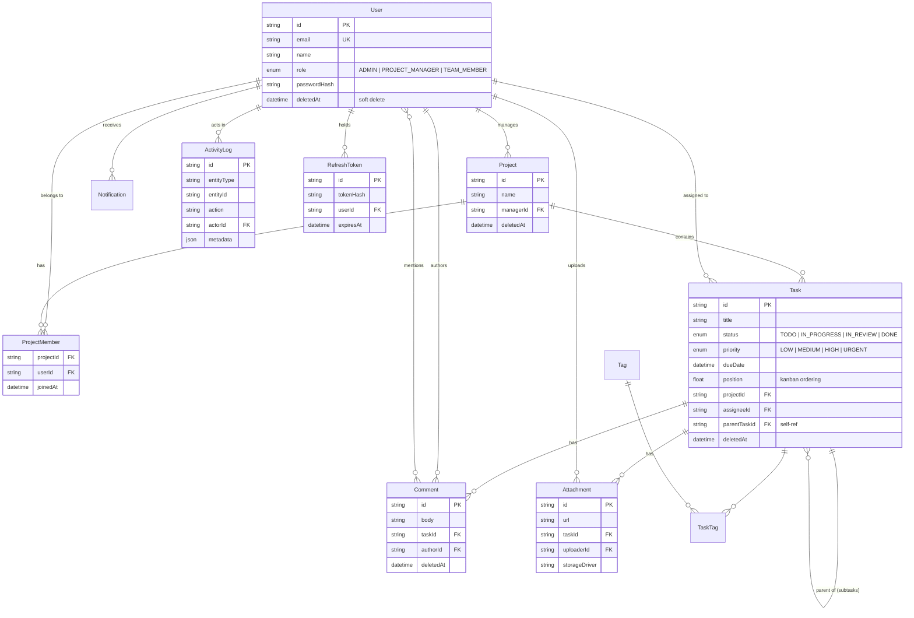
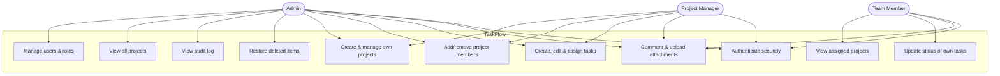

# TaskFlow — Project & Team Task Management Platform

A full-stack task management platform with three roles (Admin, Project Manager, Team Member), secure JWT authentication with refresh-token rotation, server-side role- and ownership-based access control, a Kanban board with drag-and-drop, role-specific dashboards, and a full REST API.

Built as the CyphLab (Private) Limited full-stack internship take-home.

---

## Live deployment

| Layer | URL |
|---|---|
| **Frontend** (Vercel) | https://cyphlab-taskflow-web.vercel.app |
| **API** (Railway) | https://taskflow-api-production-831d.up.railway.app |
| **API health check** | https://taskflow-api-production-831d.up.railway.app/api/health |
| **Database** | Neon (PostgreSQL 16, AWS us-east-1) |

> **Note:** the API runs on Railway's free trial tier. The first request after a period of inactivity may take a few seconds to warm up. Once awake it responds normally.

---

## Demo accounts

All three roles are seeded and ready to log in. Password for every account: `Password123!`

| Role | Email | What it demonstrates |
|---|---|---|
| **Admin** | sarah@taskflow.dev | Full system access — user management, all projects, activity/audit log, restore |
| **Project Manager** | james@taskflow.dev | Create/manage own projects, assign members, create and assign tasks |
| **Team Member** | aisha@taskflow.dev | View assigned projects, move own task cards on the Kanban board, comment |

Logging in as each role shows a different dashboard, different navigation, and different permissions — the access control is enforced server-side, not just hidden in the UI.

---

## Tech stack

**Frontend**
- Next.js 15 (App Router) + TypeScript
- Tailwind CSS + shadcn/ui
- TanStack Query (server state) + Zustand (UI state)
- react-hook-form + Zod (forms & validation)
- Recharts (dashboard charts)
- @dnd-kit (Kanban drag-and-drop)

**Backend**
- Node.js + Express + TypeScript
- Prisma ORM + PostgreSQL
- JWT access tokens + rotating refresh tokens (httpOnly cookies)
- @node-rs/argon2 (password hashing)
- Zod validation on every request
- Swagger / OpenAPI docs

**Infrastructure**
- pnpm monorepo (`apps/web`, `apps/api`, `packages/types`)
- Docker + Docker Compose (full stack boots with one command)
- GitHub Actions CI (lint → typecheck → test → build)
- Cloudinary (file storage in production)

---

## Features

**Authentication & security**
- Register, login, logout, refresh, forgot/reset password, email verification
- JWT access token (15 min, in memory) + refresh token (7 days, httpOnly + Secure cookie, **rotated on every use**, family-revoked on reuse detection)
- Argon2id password hashing
- Rate limiting on auth endpoints, Helmet, CORS allowlist

**Role-based access control (two layers)**
- `requireRole` — coarse role check from the JWT
- Project- and task-level guards — database-backed ownership/membership checks, so a Project Manager cannot touch another PM's project just because they hold the PM role

**Core functionality**
- Projects with members (many-to-many), tasks with assignees, priorities, due dates, tags
- Kanban board with drag-and-drop status/position changes (optimistic UI with rollback)
- Task comments with @mentions, file attachments
- In-app notifications, global search (⌘K command palette)
- Activity/audit log (admin-visible)
- Soft delete + admin-only restore
- Role-specific dashboards with charts
- Dark mode, responsive down to mobile

---

## Quick start (local)

Requires Docker Desktop. The entire stack — database, API, frontend — boots with one command.

```bash
git clone https://github.com/Kaveeshamanu/cyphlab-taskflow.git
cd cyphlab-taskflow
cp .env.example .env
docker compose up
```

On startup the API container generates the Prisma client, applies migrations, and seeds realistic demo data (12 users, 5 projects, ~60 tasks) automatically — no manual steps.

- Frontend → http://localhost:3000
- API → http://localhost:4000
- API health → http://localhost:4000/api/health
- API docs (Swagger) → http://localhost:4000/api/docs

Log in with any of the demo accounts above.

### Running without Docker

```bash
pnpm install
# start a local Postgres and set DATABASE_URL in .env
pnpm --filter @taskflow/api prisma migrate deploy
pnpm --filter @taskflow/api prisma db seed
pnpm dev
```

---

## Architecture



**Request lifecycle:** a request hits Express → `requireAuth` verifies the access token → `requireRole` checks the coarse role → a project/task guard runs a database-backed ownership check → the Zod schema validates the body → the controller calls the service → Prisma reads/writes Postgres → a consistent response envelope `{ success, data, message, errors }` is returned. A Prisma client extension filters soft-deleted rows and records audit-log entries centrally.

**Cross-site auth:** the frontend (vercel.app) and API (railway.app) are different sites, so the refresh cookie is set `SameSite=None; Secure; Partitioned` in production with an exact-origin CORS allowlist. Short-lived in-memory access tokens plus rotating refresh tokens mitigate the CSRF exposure this opens.

---

## Entity relationship diagram



---

## Use case diagram



---

## Permission matrix (enforced server-side)

| Action | Admin | Project Manager | Team Member |
|---|:---:|:---:|:---:|
| CRUD any user / assign roles | ✅ | ❌ | ❌ |
| View all projects | ✅ | own only | assigned only |
| Create project | ✅ | ✅ | ❌ |
| Edit / delete project | ✅ | own only | ❌ |
| Add / remove project members | ✅ | own only | ❌ |
| Create / edit / delete task | ✅ | own projects | ❌ |
| Assign task to a user | ✅ | own projects | ❌ |
| Update task status | ✅ | own projects | own assigned tasks |
| Comment / upload attachment | ✅ | own projects | projects they're in |
| View audit log | ✅ | ❌ | ❌ |
| Restore soft-deleted items | ✅ | ❌ | ❌ |

Every rule above is covered by an integration test asserting the correct `403` / `401` responses.

---

## API documentation

- **Swagger UI:** `/api/docs` on the running API (every endpoint documented with request/response schemas)
- **Postman collection:** [`postman_collection.json`](./postman_collection.json) in the repo root — import it to exercise the full API

All endpoints are versioned under `/api/v1`, validated with Zod, and return the standard envelope:

```json
{ "success": true, "data": {}, "message": "", "errors": null }
```

List endpoints support pagination, filtering, and sorting via query parameters.

---

## Testing

Integration tests (Vitest + Supertest) cover the parts most likely to break silently:

- Auth: login, wrong password, refresh-token rotation, reuse of a rotated token rejected, rate limiting
- **RBAC** (the core of the grading): Team Member → `POST /tasks` = 403; Team Member → `GET /users` = 403; PM editing another PM's project = 403; unauthenticated request to a protected route = 401
- Validation: malformed payloads return 422 with a field-level `errors` array
- Task lifecycle: create → assign → notification created → status update → activity logged
- Soft delete: deleted items excluded from lists, restorable by admin only

```bash
pnpm test
```

---

## CI/CD

GitHub Actions runs on every push and pull request (`.github/workflows/ci.yml`):

| Job | Steps | Purpose |
|---|---|---|
| **quality** | install → `eslint` → `tsc --noEmit` | Catches lint and type errors before merge |
| **test** | spin up `postgres:16` → `prisma migrate deploy` → `prisma generate` → `vitest run` | Runs the full integration suite against a real database |
| **build** | build API → build web → validate Dockerfiles | Confirms both apps compile and the images build |

Deployment is continuous: pushing to `main` triggers Railway (API) and Vercel (frontend) to build and deploy automatically. The database lives on Neon; migrations are applied by the API container's entrypoint on startup.

One CI detail worth noting: the `quality` job needs its own `prisma generate` step because the generated client isn't committed — without it, TypeScript reports implicit-`any` errors on a clean machine even though the code is correct locally.

---

## AI usage disclosure

**Tool used:** Claude Code (Anthropic).

**What it assisted with:** project scaffolding, boilerplate CRUD controllers, Tailwind/shadcn component wiring, Docker and CI configuration, seed data generation, and test scaffolding.

**What I designed and directed myself:** the data model and all entity relationships, the authentication flow (refresh-token rotation and reuse detection, hashing strategy), the two-layer role- and ownership-based authorization middleware, and the cross-site cookie/CORS configuration for the split deployment.

**Process:** I reviewed every change before committing it, debugged the deployment and Docker/Prisma issues myself, and can explain every design decision in the codebase.

---

## Known scope decisions

A few features were intentionally scoped out to keep the core complete, tested, and deployed within the time budget. These are documented in [`docs/FEATURE_REPORT.md`](./docs/FEATURE_REPORT.md): subtask UI, tag editing UI, and profile editing. The underlying data model supports all three.
